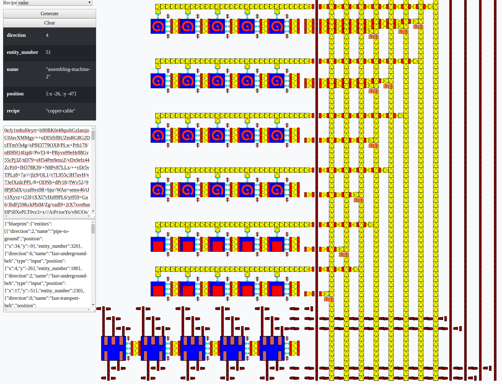
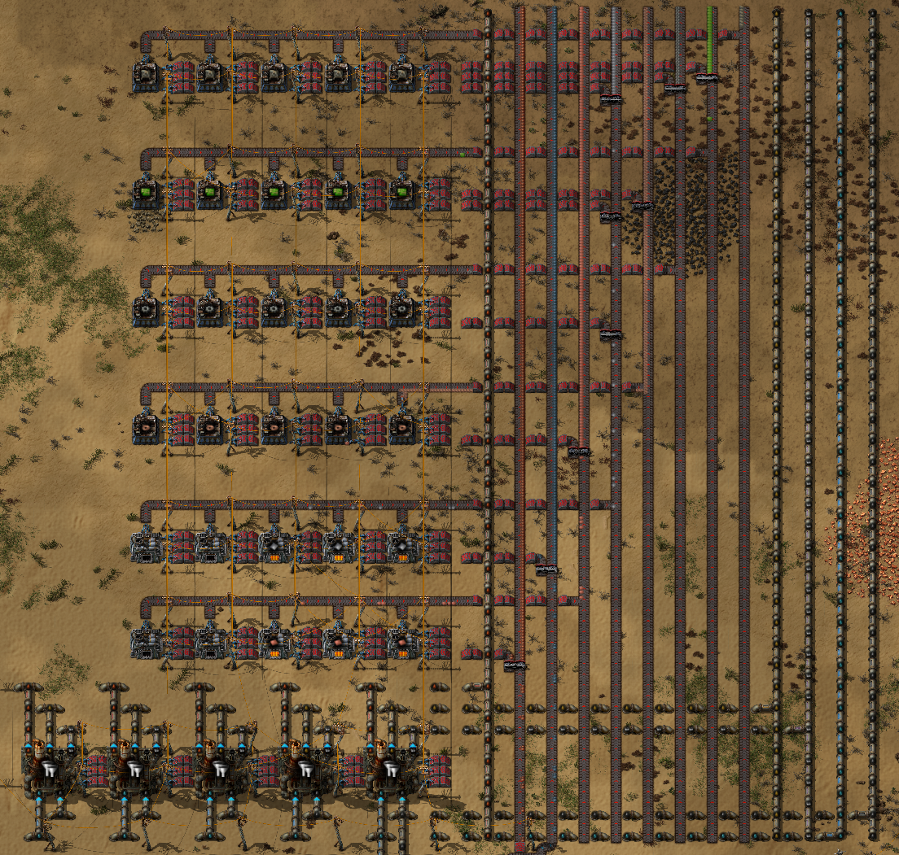

# busmaker -- alpha version

Generates a simple bus architecture for factorio, which
generates the selected recipe.

## Usage

Visit https://tristanstraub.github.io/busmaker/build/index.html

1. Select a recipe
2. Press generate, and wait for the blueprint to be generated and rendered (may take some seconds).
3. Click on the base64 encoded blueprint (will be copied to the clipboard)
4. Import via blueprints in factorio

## Issues:

- Always includes oil processing
- Doesn't use correct factory for rocket-silo
- Not many recipes have been tested (many hacks in the code).

## Example -- building radars

## Building

boot production build target
cp target/public/index.html build/
cp target/public/js/app.js build/js
cp target/public/css/garden.css build/css

